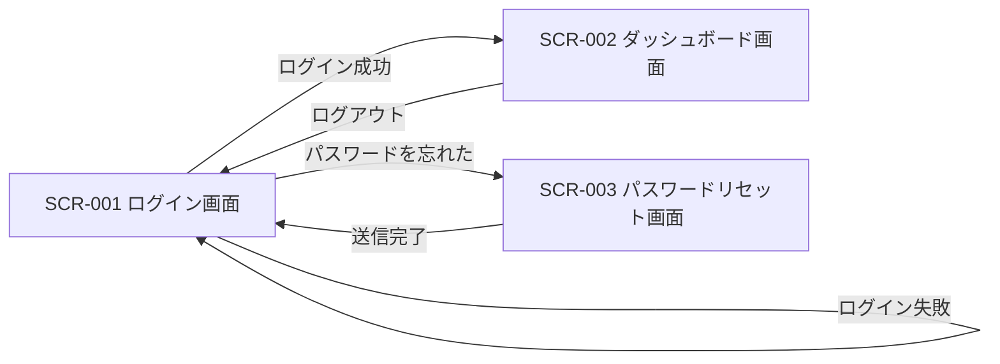

# SPEC.md

> このファイルは人間が記述する要件定義書です。
> investigator・architectが参照して調査・設計を進め、reviewer・testerが合否判定の基準として参照します。
> 曖昧な記述はブロッカーの原因になるため、各セクションを具体的に記述してください。

> **エージェント向け運用ルール:**
> - 「12. 未決事項」に依存する作業に遭遇した場合、推測で補完せずチケットを `blocked` にし、ブロッカーセクションに未決事項のID(OQ-xxx)を記載すること。
> - 機能要件は必ず要件ID(REQ-xxx)で、画面は画面ID(SCR-xxx)で、提供インターフェースはインターフェースID(IF-xxx)で、横断的なエラーハンドリング方針は方針ID(EH-xxx)で参照すること。チケット・設計書には対応するIDを明記すること。
> - Should/Could要件は、Must要件がすべて `done` になるまで着手しないこと(人間が明示的に指示した場合を除く)。
> - 画面・提供インターフェースの**存在と役割**は本書「6. 画面・インターフェース一覧」が正、画面の**レイアウト・見た目**はワイヤーフレーム(docs/wireframes/)が正とする。両者が矛盾する場合は作業を進めず人間に確認すること。

---

## 0. 文書情報・変更履歴

<!-- SPECは更新される前提の文書です。設計書がどの版のSPECに基づいたか追跡できるよう、更新のたびに行を追加してください -->
<!-- ワイヤーフレーム作成後に画面の過不足へ気づいた場合も、版を上げて「6. 画面・インターフェース一覧」へ反映すること -->

| 版数 | 更新日 | 更新者 | 変更概要 |
|---|---|---|---|
| v1.0 | YYYY-MM-DD | (氏名) | 初版作成 |
| v1.1 | YYYY-MM-DD | (氏名) | ワイヤーフレーム作成に伴い画面一覧を改訂(例) |

---

## 1. プロジェクト概要

<!-- 何を作るのかを3行以内で。技術的な詳細は不要 -->

例:
> ユーザーがメールアドレスとパスワードでログインできるWebアプリケーションを構築する。
> 認証後はダッシュボード画面へ遷移し、ユーザー固有のデータを表示する。

---

## 2. 背景・目的

<!-- なぜ作るのか。解決したい課題や達成したいビジネス目標を記述する -->

例:
> 現在は手動でCSVを管理しており、データ更新に1日かかっている。
> このシステムにより更新作業を自動化し、作業時間をゼロにすることを目的とする。

---

## 3. 用語集

<!-- 本文書およびチケット・設計書で使う用語を定義する。エージェント間の解釈揺れを防ぐため、多義的な用語は必ず定義すること -->

| 用語 | 定義 |
|---|---|
| ユーザー | 本システムにアカウント登録済みの利用者。未登録の訪問者は「ゲスト」と呼ぶ |
| セッション | ログインからログアウトまたは有効期限切れまでの認証状態 |

---

## 4. ユーザー・ステークホルダー

<!-- 誰が使うのかを明示する。ユーザー種別ごとに分けて記述する -->

| ユーザー種別 | 説明 | 主な操作 |
|---|---|---|
| 一般ユーザー | 登録済みの利用者 | ログイン・データ閲覧 |
| 管理者 | システム管理担当者 | ユーザー管理・設定変更 |

---

## 5. 機能要件

<!-- 「〜できること」の形式で記述し、必ず要件ID(REQ-xxx)を振る。IDは欠番が出ても再利用しない -->
<!-- Must項目には正常系だけでなく「失敗時・異常時の挙動」も必ず記述する(横断的な方針は「7. エラーハンドリング・異常系方針」に定義し、備考でEH-IDを参照してよい) -->
<!-- 「12. 未決事項」に依存する要件はMustに入れず、備考欄に依存するOQ-IDを記載する -->

### Must(必須)

| ID | 要件 | 関連画面 | 備考 |
|---|---|---|---|
| REQ-001 | ユーザーはメールアドレスとパスワードでログインできる | SCR-001 | |
| REQ-002 | ログイン失敗時は具体的な失敗理由を含まない汎用エラーメッセージを表示する | SCR-001 | セキュリティ配慮 |
| REQ-003 | ユーザーはログアウトできる | SCR-002 | |

### Should(できれば)

| ID | 要件 | 関連画面 | 備考 |
|---|---|---|---|
| REQ-101 | パスワードリセット機能を提供する | SCR-003 | OQ-002に依存 |
| REQ-102 | ログイン状態を7日間保持できる | - | OQ-001に依存 |

### Could(余裕があれば)

| ID | 要件 | 関連画面 | 備考 |
|---|---|---|---|
| REQ-201 | Googleアカウントでのソーシャルログインに対応する | SCR-001 | |

---

## 6. 画面・インターフェース一覧

<!-- 本セクションは「画面・提供インターフェースの存在と役割」を定義する。レイアウト・配置・ビジュアルの詳細はワイヤーフレーム側に記載し、本書には書かない(二重管理による乖離を防ぐため) -->
<!-- 画面にはID(SCR-xxx)を、提供インターフェースにはID(IF-xxx)を振り、IDは欠番が出ても再利用しない -->
<!-- ワイヤーフレームは単一ファイルの静的HTML(外部依存なし・ビルド不要・ブラウザで直接開ける)とし、必ずリポジトリ内(docs/wireframes/)に配置する。ファイル名は「SCR-ID-画面名英語.html」(例: SCR-001-login.html) -->
<!-- ワイヤーフレームは構造とレイアウトの確認が目的であり、実装コードの雛形ではない。エージェントは外部URL(Figma等)を参照できない場合がある -->
<!-- UIを持たないプロジェクト(API・バッチ等)の場合は、画面一覧・画面遷移図に「該当なし」と明記し、「提供インターフェース一覧」を必ず記述すること -->

### 画面一覧

| ID | 画面名 | 目的 | 主な要素 | 対応要件 | アクセス可能なユーザー | ワイヤーフレーム |
|---|---|---|---|---|---|---|
| SCR-001 | ログイン画面 | 認証を行う | メールアドレス入力・パスワード入力・ログインボタン・エラーメッセージ表示 | REQ-001, REQ-002 | ゲスト | docs/wireframes/SCR-001-login.html |
| SCR-002 | ダッシュボード画面 | ユーザー固有データの閲覧起点 | データ一覧・ログアウトボタン | REQ-003 | 一般ユーザー・管理者 | docs/wireframes/SCR-002-dashboard.html |
| SCR-003 | パスワードリセット画面 | パスワードの再設定 | メールアドレス入力・送信ボタン | REQ-101 | ゲスト | (未作成) |

### 提供インターフェース一覧

<!-- システムが外部(利用者・他システム)へ提供するAPI・CLI・バッチ等のインターフェースを定義する。画面のみで完結するプロジェクトでは「該当なし」と明記してよい -->
<!-- 本表は「提供する」側のインターフェースの正。「利用する」外部サービスは「10. データ・外部インターフェース要件」に記載する(混在させない) -->

| ID | 名称 | 種別 | 目的 | 入力・出力の概要 | 対応要件 | 利用者 |
|---|---|---|---|---|---|---|
| IF-001 | (例: 認証API) | REST API | 認証を行いセッションを発行する | 入力: メールアドレス・パスワード / 出力: セッショントークン | REQ-001 | フロントエンド |

### 画面遷移図

<!-- Mermaid記法で主要な遷移を記述する。すべての遷移を網羅する必要はなく、主動線がわかればよい -->

---

## 7. エラーハンドリング・異常系方針

<!-- 個別要件に書ききれない横断的な異常系の方針を記述する。曖昧なままだとテスト差し戻しの主要因になる -->
<!-- 方針にはID(EH-xxx)を振り、IDは欠番が出ても再利用しない。§5のMust要件の失敗時挙動が本節の方針に従う場合は、要件の備考にEH-IDを記載して参照してよい -->
<!-- testerが合否判定できるよう「検証方法」を必ず記載する。自動検証できない項目は「人間が確認」と明記する(§8と同じ規約) -->
<!-- 各EHをどのチケットで検証するかは /plan-tickets のカバレッジ確認で割り当てる -->

| ID | 分類 | 方針 | 検証方法 |
|---|---|---|---|
| EH-001 | 入力バリデーション | すべての入力はサーバーサイドで検証する。クライアント検証は補助とする | 自動テスト(不正入力がサーバーサイドで拒否されることを確認) |
| EH-002 | 認証失敗 | 5回連続失敗で15分間アカウントをロックする | 自動テスト(6回目の試行が拒否されることを確認) |
| EH-003 | 外部サービス障害 | メール送信失敗時は3回までリトライし、失敗をログに記録する | 自動テスト(送信モックの失敗時にリトライ回数とログ出力を確認) |
| EH-004 | 想定外エラー | ユーザーには汎用エラー画面を表示し、詳細はサーバーログにのみ出力する | 自動テスト(500系エラー時の表示とログ出力先を確認) |

---

## 8. 非機能要件

<!-- 品質に関する要件を記述する。testerが合否判定できるよう「検証方法」を必ず記載する。自動検証できない項目は「人間が確認」と明記する -->
<!-- 要件にはID(NFR-xxx)を振り、IDは欠番が出ても再利用しない -->
<!-- 各NFRをどのチケットで検証するかは /plan-tickets のカバレッジ確認で割り当てる(「人間が確認」の項目は割り当てず、ループ外で人間が確認する) -->

| ID | 項目 | 要件 | 検証方法 |
|---|---|---|---|
| NFR-001 | レスポンスタイム | ログイン処理は2秒以内に完了すること | 自動テストで応答時間を計測 |
| NFR-002 | セキュリティ | パスワードはbcryptでハッシュ化して保存すること | コードレビューおよびDB格納値の確認テスト |
| NFR-003 | 対応ブラウザ | Chrome・Firefox・Safariの最新版 | 人間が確認(自動検証対象外) |
| NFR-004 | 可用性 | 平日9〜18時は99%以上の稼働率を維持すること | 人間が確認(監視ツールで運用計測) |

---

## 9. 技術的制約

<!-- 使用する技術スタック・既存システムとの制約・インフラの制限などを記述する -->
<!-- バージョンは必ず明記する。導入可否が未確定のライブラリは「12. 未決事項」に記載する -->
<!-- 出自を必ず注記する: 標準構成をデフォルト適用した場合は冒頭に「本構成は標準構成 vX.X (YYYY-MM-DD) をデフォルト適用したものである」の注記を置き、人間・組織による明示指定項目には行頭に ★ を付す(転記ルールの正は .claude/skills/spec-interview/templates/DEFAULT_STACK.md セクション3) -->

例:
- 使用言語: TypeScript 5.x
- フレームワーク: Next.js 14
- データベース: PostgreSQL(既存のRDSインスタンスを使用)
- 認証ライブラリ: NextAuth.js(新規導入)
- デプロイ先: Vercel
- 禁止事項: (例: 有料ライセンスが必要なライブラリの導入禁止)

---

## 10. データ・外部インターフェース要件

<!-- 扱うデータの種類・機密区分・保持期間、および外部サービスとの連携仕様を記述する -->
<!-- シークレット(APIキー・接続文字列など)の値は本文書に記載せず、環境変数名のみを記載すること(docs/security-policy.md に準拠) -->

### 取り扱いデータ

| データ | 機密区分 | 保持期間 | 備考 |
|---|---|---|---|
| メールアドレス | 個人情報 | 退会後30日で削除 | |
| パスワード | 機密 | ハッシュ値のみ保存 | 平文保存禁止 |

### 外部インターフェース

| 連携先 | 用途 | 認証方式 | 環境変数名 |
|---|---|---|---|
| (例: SendGrid) | メール送信 | APIキー | SENDGRID_API_KEY |

---

## 11. スコープ外(明示的な除外事項)

<!-- やらないことを明示する。investigatorが調査範囲を誤らないため、implementerが過剰実装しないために重要 -->

- 多言語対応(日本語のみ)
- モバイルアプリ(Webのみ)
- 管理者向けのログ分析機能

---

## 12. 未決事項(Open Questions)

<!-- まだ決まっていない事項にID(OQ-xxx)を振って列挙する。IDは欠番が出ても再利用しない。決まり次第、内容を該当セクションへ反映し、この表のステータスを「決定済」に更新する -->
<!-- エージェントはOQに依存する作業を推測で進めてはならない。遭遇した場合はチケットをblockedにし、該当OQ-IDを記載すること -->

| ID | 事項 | ステータス | 決定内容 |
|---|---|---|---|
| OQ-001 | セッション管理にJWTとCookieのどちらを使うか | 未決定 | |
| OQ-002 | パスワードリセット用のメール送信サービスは何を使うか | 未決定 | |

---

## 13. 成功基準

<!-- 何をもって完成とするかを定量的に記述する。原則としてREQ-ID/NFR-ID/SCR-IDを参照する形で書く -->

- Must要件(REQ-001〜REQ-003)のすべてが受け入れ基準を満たし `done` になっていること
- Must要件に対応するすべての画面(SCR-001, SCR-002)がワイヤーフレームどおりに実装されていること
- 単体テストのカバレッジが80%以上であること
- すべての非機能要件(NFR-001〜NFR-004)が「検証方法」欄の方法で確認済みであること
- すべてのエラーハンドリング方針(EH-001〜EH-004)が「検証方法」欄の方法で確認済みであること

---

## 14. 参考資料

<!-- デザインモックアップ・既存システムのドキュメント・参考URLなどを記載する -->
<!-- 注意: エージェントは外部URL(Figma等)を直接参照できない場合がある。エージェントに読ませたい資料は可能な限りリポジトリ内(docs/references/ など)に配置し、そのパスを記載すること -->
<!-- ワイヤーフレームは「6. 画面・インターフェース一覧」から参照するため、本セクションには記載不要 -->

- Figmaデザイン: (URLを記入 / エクスポート画像は docs/references/ に配置)
- 既存システムのER図: (リポジトリ内パスを記入)
